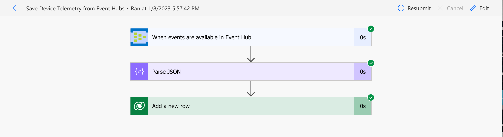
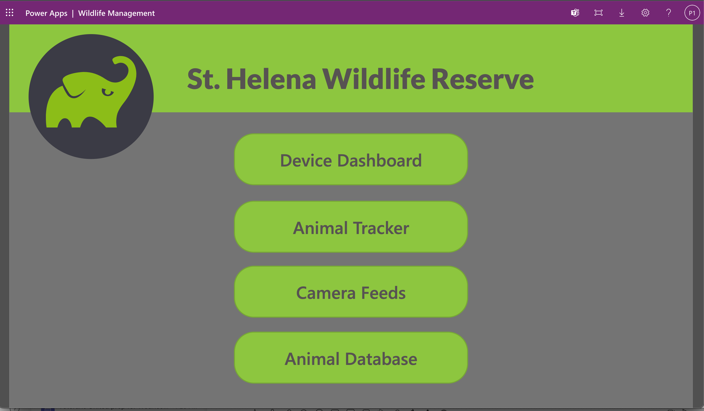
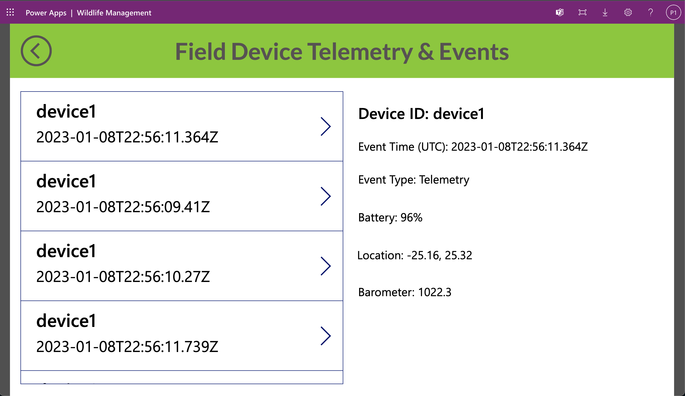

# Power Platform - Low Code Applications and Workflows with Open Platform

Microsoft Power Platform is a suite of services to create custom applications and automate workflows using low-code tools. It includes four main components:

* Power BI: Tools for creating low-code interactive data visualizations.
* Power Apps: A platform for building custom no-code/low-code applications.
* Power Automate: A service for creating low-code automate workflows and tasks.
* Power Virtual Agents: Low-code chatbots that can answer questions and perform tasks for end users.

These tools and services allow non-traditional developers to develop web applications and to access to data via a system of built-in data connectors.

In this example, a Power Automate flow is triggered as events are available in the Open Platform's Event and saved to the local database (Dataverse). The sample Power App is then able to access these events to show information in the dashboard and for device tracking on a map.

## Prerequisites 📝

 * Access to Power Apps + Premium  connectors (Dataverse + Event Hubs)
    * [Power Apps Developer Plan](https://powerapps.microsoft.com/en-us/landing/developer-plan/)
    * Access to [Geospatial Features](https://learn.microsoft.com/en-us/power-apps/maker/canvas-apps/geospatial-overview#enable-geospatial-features-for-the-environment) within your environment
 * Access to an instance of Project 15 Open Platform running in Microsoft Azure

## Setup Sample Power App 🔧

* [Import](https://docs.microsoft.com/en-us/powerapps/maker/data-platform/import-update-export-solutions) the Power Platform solution archive [in this repository](../Solutions).
* When you import the solution, it will prompt for creation of connections to the Dataverse database and to the Event Hub namespace for Project 15 running in Azure. Create the connections and be sure they are selected.
* When you open the application, it will also ask you to allow access to these connections.

## Additional Resources 🎁

* [Introduction to Power Apps](https://learn.microsoft.com/en-us/training/modules/introduction-power-platform/)
* [Introduction to Power Automate](https://powerapps.microsoft.com/en-us/power-apps-and-azure/)
* [Introduction to Dataverse](https://learn.microsoft.com/en-us/training/modules/introduction-common-data-service/)
* [Power Platform Solutions Overview](https://learn.microsoft.com/en-us/power-apps/maker/data-platform/solutions-overview)
* [Event Hubs Data Connector](https://learn.microsoft.com/en-us/connectors/eventhubs/) Reference
* [Power Apps Geospatial Controls](https://learn.microsoft.com/en-us/power-apps/maker/canvas-apps/geospatial-overview)
* [Power Platform CLI](https://learn.microsoft.com/en-us/power-platform/developer/cli/introduction)
