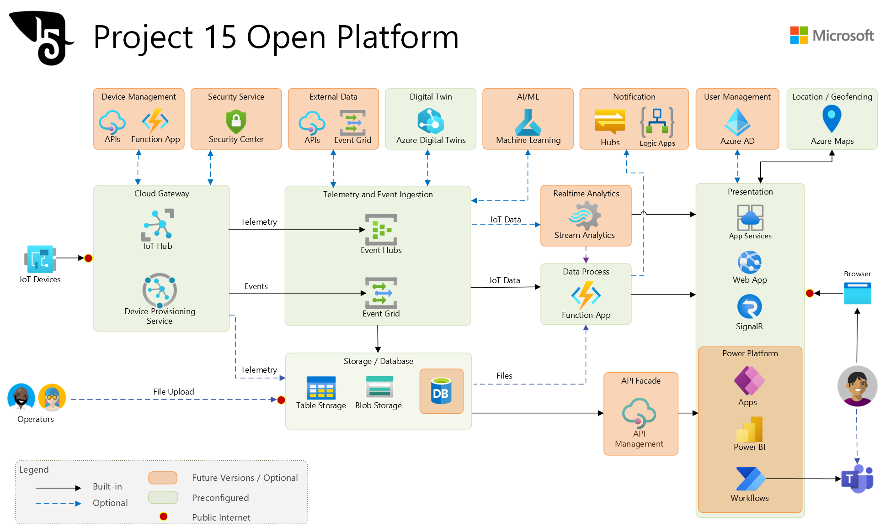

# Project 15 Open Platform for Conservation and Ecological Sustainability Solutions

| Quick Links                                          | Description                                                                                                                                  |
|------------------------------------------------------|----------------------------------------------------------------------------------------------------------------------------------------------|
| [Deploy](Deploy/Deployment.md)                       | Deploy the Project 15 Open Platform to Azure and configure into your Azure account with click of a button. |
| [Developer Guide](Developer-Guide/DeveloperGuide.md) | Double click into developing on the Project 15 Open Platform. Includes deep dive into the architecture and features. |
| [Edge Impulse](https://github.com/microsoft/project15/tree/EdgeImpulse/Edge-Impulse-Guide) | https://github.com/microsoft/project15/tree/EdgeImpulse/Edge-Impulse-Guide | Explore the integration of Edge Impulse with the Project 15 Open Platform and bringing TinyML to your solution. |
| [Power Platform](https://powerplatform.microsoft.com/) | Democratize application development and increase access to data by including low-code applications, workflows, bots, and analytics into the Project 15 Open Platform. |
| [Planetary Computer](https://planetarycomputer.microsoft.com/) |  Coming soon. Open-source low-code data connector for Microsoft Planetary Computer APIs |
| Project 15 Capstones | [The "Project 15 Challenge" Capstone Library](#The-Project-15-Challenge-Capstone-Library) |

## About Project 15 Open Platform

Our goal with a conservation and ecosystem sustainability open platform is to bring the latest Microsoft cloud and Internet of Things (IoT) technologies to accelerate scientific teams building sustainability and conservation solutions like species tracking & observation, poaching prevention, ecosystem monitoring, pollution detection, etc.

The P15 Open Platform will get teams roughly 80% of the way to a finished solution.

In under 15 minutes, the infrastructure needed with Azure IoT services will spin up to bring a solution roughly 80% of the way to a finished state.

In 2021, we worked with [Edge Impulse](https://www.edgeimpulse.com/) to integrate their TinyML platform.

In 2023, we integrated the Open Platform with Power Platform to address the app gap challenge and will be contributing an Open Source data connector to the [Microsoft Planetary Computer](https://planetarycomputer.microsoft.com/) APIs.

Currently maintained by developers at Microsoft, Project 15’s Open Platform is not an official product from Microsoft.

The core goals of the P15 Open Platform are:

1. **Close the Skill Gap**
    Boost innovation with a ready-made platform, allowing the scientific developer to expand into specific use cases.
1. **Increase Speed to Deployment**
    Open Platform get teams 80% of the way with their projects, dramatically reducing the time to start building crucial insights.
1. **Lower the development cost**
    The Open Platform lowers the cost of overall development and reduces complexity. Opens up opportunities for partnering with the Open Source developer community and universities.

With deployment to Azure in a **push of a button**, he main components of the infrastructure for a standard IoT Solution will be up and running. We have documented some of the common scenarios for simulation of device data, connection of a device, and how to connect a device based solution to Power Platform for low code/no code development. If you have a specific scenario you need help with, please submit an [issue ticket](https://docs.github.com/en/desktop/contributing-and-collaborating-using-github-desktop/creating-an-issue-or-pull-request).

If you would like to contribute a feature or module to the Project 15 repo, submit a [pull request](https://docs.github.com/en/desktop/contributing-and-collaborating-using-github-desktop/creating-an-issue-or-pull-request).

## Solution Overview

The solution has three main categories:

1. **Components that are fully included**

    These are Azure services that if someone was standing up the solution these parts of the infrastructure only need to be deployed once and then expanded as devices get added to the solution. To learn all the ins and outs of these services is a lift and would take time. Our theory here is that by this method, the technologist doesn't need to know every nitty-gritty detail and can expand their learning as needed. For learning about building an IoT Solution, a great resource to ramp up quickly on the concepts with real world examples and labs is available at [Internet of Things Learning Path](https://aka.ms/iotlp). Of course, if one wants to learn all the details, Microsoft Learn's [Introduction to Azure IoT](https://docs.microsoft.com/learn/paths/introduction-to-azure-iot/) has all you need. All our learning resources here, are free to you.

1. **Included Components but needs customization**

    Here the solution will deploy these services for you, but you will start to modify and add to them based on your use case. The details of the services here are all explained in our [Project 15 Open Platform Developer Guide](Developer-Guide/DeveloperGuide.md). The high level architecture of what services are involved, see blow.

1. **Not Included, requires full customization**

    This is the part where your IP will reside.  How this works is once you `Deploy` the solution to your own Azure account, **it is yours to build out**. Think of how you use a word processor. The word processor is a tool and the book you write, is yours. Meaning the story you publish is yours, the revenue generated is yours. Same idea. This solution is a tool for you to use to write your own solutions.

### Solving for Roadblocks

In 2019 when we started meeting scientists leading a variety of different projects we started to see some patterns. Identifying “why do these critical projects stall?” By our estimation the stall factor fell into six main categories. Not only were scientific technologists re-inventing wheels that already existed “in industry.” What we realized is that not only could our partner ecosystem help to drive these projects forward but we, ourselves, as developers could create an Open Platform to help.

If you are more familiar with the commercial side of IoT Solutions, you will see right away that these roadblocks are familiar. These are problems that for years Microsoft has been working to solve and has come out with a portfolio of tools and services that make IoT solutioning less complex. But for scientifically based projects, there is a nuance to the business model in that it is mostly grant funded. With that model, we needed to rethink how to accelerate the time to market.

### Open Platform Architectural Diagram

Our [Developer's Guide](Developer-Guide/DeveloperGuide.md) is the resource to double-click into the details on the P15 Open Platform services.

For a quick start guide to deployment, please visit our [Deployment Guide](Deploy/Deployment.md).

## Other Resources

| Resource Link                                                      | Description                                                                                                                                                                         |
|--------------------------------------------------------------------|:------------------------------------------------------------------------------------------------------------------------------------------------------------------------------------|
| [Seeed Studio’s IoT Into the Wild](https://www.seeedstudio.com/iot_into_the_wild.html) | Device product line to digitize the wild for better monitoring and conservation solutions. |
| [Planetary Computer](https://planetarycomputer.microsoft.com/) | The Planetary Computer combines a multi-petabyte catalog of global environmental data with intuitive APIs, a flexible scientific environment that allows users to answer global questions about that data, and applications that put those answers in the hands of conservation stakeholders. |
| [Microsoft Learn](https://aka.ms/learn)| Microsoft's comprehensive and free learning platform. |

## The Project 15 Challenge Capstone Library

The Project 15 Challenge from Microsoft worked with leading universities to design graduate thesis projects that students used to complete their advanced degrees.  Partnering students and student groups with leading NGOs to solve problems needing to be unlocked.

For example, the [Elephant Listening Project at Cornell University](https://elephantlisteningproject.org/) asked a group of students at Oxford University if they could “count elephants” using infrasound.  A problem that has never been solved in the conservation community to that day.  Within weeks, the students were able to apply techniques from the commercial realm to unlock elephant counting.

All these projects are available on GitHub for you to bring in to the solutions you are building.

Harvard University

* [Harvard Extension School w/ NASA](https://github.com/KorayKinik/heat-extremes-CMIP6)

University College London

* [UCL Capstone Project w/ Red Panda Network](https://github.com/faridelaouadi/RedPandaNetwork)

* [UCL Capstone Project w/ Project 15 from Microsoft - Anti-Poaching Cognitive Model](https://techcommunity.microsoft.com/t5/educator-developer-blog/building-tools-to-help-create-a-system-to-prevent-elephant/ba-p/2282777)

University of Oxford

* [University of Oxford Capstone Project w/ Elephant Listening Project Team 1](https://techcommunity.microsoft.com/t5/educator-developer-blog/microsoft-project15-amp-university-of-oxford-capstone-project/ba-p/2261923)
* [University of Oxford Capstone Project w/ Elephant Listening Project Team 2](https://techcommunity.microsoft.com/t5/educator-developer-blog/microsoft-project15-amp-university-of-oxford-capstone-project/ba-p/2262001)
* [University of Oxford Capstone Project w/ Elephant Listening Project Team 3](https://techcommunity.microsoft.com/t5/educator-developer-blog/microsoft-project15-amp-university-of-oxford-capstone-project/ba-p/2262203)
* [University of Oxford Capstone Project w/ Elephant Listening Project Team 4](https://techcommunity.microsoft.com/t5/educator-developer-blog/microsoft-project15-amp-university-of-oxford-capstone-project/ba-p/2262312)

Imperial College London

* [Imperial College London w/ Elephant Listening Project](https://techcommunity.microsoft.com/t5/educator-developer-blog/microsoft-project-15-elephant-listening-project-at-imperial/ba-p/2485639)

## What was Project 15 from Microsoft

In 2019, [Sarah Maston](https://www.linkedin.com/in/smwmaston/) met [Eric Dinerstein](https://www.resolve.ngo/directory/EricDinerstein.htm) and realized her skills as a commercial solution architect were applicable.  When Eric taught her that we lose one elephant every fifteen minutes, she was set into motion.  She told Eric she would find an “Army of Nerds” to help Eric and his friends.

The first friend she recruited to this mission was [Daisuke Nakahara](https://www.linkedin.com/in/daisuke-nakahara/).

It grew from there.

The [first Project 15 from Microsoft video](https://learn.microsoft.com/en-us/shows/azure-videos/project-15) launched in October 2019 at Microsoft’s IoT in Action Global Event Series and reached 33,000 technologists in the first year from the Microsoft IoT Partner ecosystem and many more.

Within 3 months, Daisuke and Sarah were [partnered with the GEF Small Grants Program implemented by UNDP](https://sgp.undp.org/resources-155/our-stories/653-accelerating-local-action-and-innovation-with-microsoft-s-project-15.html) and working to bring scale enablement to 25,000 NGO projects and led to the invention of the Open Platform which was developed during the 2020 Microsoft Company Hackathon.

The [second Project 15 video](https://learn.microsoft.com/en-us/shows/azure-videos/how-to-be-a-hero-project-15-from-microsoft-driving-sustainability-through-iot) shares that next chapter in the story.

Beloved by developers and scientists all over the world, Project 15 ultimately became a community of hope that working together we can get these problems solved. Project 15 is not a solution, but a story people heard of how Sarah and Daisuke joined the fight for the earth, that inspired countless others to find their own way to contribute.

Read more about Project 15 from Microsoft here from the IDC : [Project 15 from Microsoft: Open Source to Enable Technology for Good (idc.com)](https://www.idc.com/getdoc.jsp?containerId=EUR148991122)
